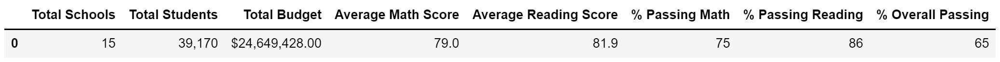
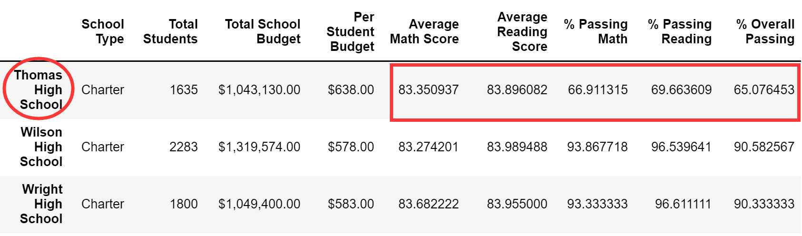

# School District Analysis

## Overview of the School District Analysis 
School District Analysis project uses schools_complete and students_complete dataset to analyze schools' performance. By analyzing 15 schools in different districts, we use Pandas along with Jupyter Notebook to prepare our school analysis based on school funding, school size, overall passing rate, ect. It gives Distric School Board insight into how each school performs. However, we received new updates on student dataset. Our goal is to define these changes and analyze the impact on overall school analysis.

## Results 
### Define changes
We replace ninth graders' math and reading scores for Thomas High School with NaN. After replacing the scores, we repeat the school district analysis. We focus on the following results:district summary and school summary.

### District summary result
How is the district summary affected?

### School summary result
How is the school summary affected?

#### How does replacing the ninth graders’ math and reading scores affect Thomas High School’s performance relative to the other schools?

#### How does replacing the ninth-grade scores affect the following:
  - Math and reading scores by grade
  - Scores by school spending
  - Scores by school size
  - Scores by school type
## Summary
Summarize four changes in the updated school district analysis after reading and math scores for the ninth grade at Thomas High School have been replaced with NaNs.
