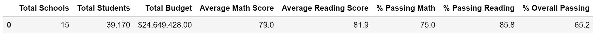

# School District Analysis

## Overview of the School District Analysis 
School District Analysis project uses schools_complete and students_complete dataset to analyze schools' performance. By analyzing 15 schools in different districts, we use Pandas along with Jupyter Notebook to prepare our school analysis based on school funding, school size, overall passing rate, ect. It gives Distric School Board insight into how each school performs. However, we received new updates on student dataset. Our goal is to define these changes and analyze the impact on overall school analysis.

## Results 
### Define Changes
We replace ninth graders' math and reading scores for Thomas High School with NaN. After replacing the scores, we repeat the school district analysis. We focus on the following results: ```District Summary``` and ```School Summary```

### District Summary Result
On our district summary, we can see that the original result has slightly different than the updated one. As we remove the math and reading scores for 9th grader from Thomas High School, the general district result doesn't make a big difference. Comparing the updated tables, the original table shows roughly *0.1* higher on the **Average Math** and **% Passing Reading scores**. However, the **% Overall Passing score** has *0.4* lower after we remove the 9th graders' math and reading scores. 

  - ```Original analysis table:```
       


  - ```Updated analysis table:```
       

### School Summary Result
On the school summary, we can see that the all the categories except the last three columns have the same result on both analysis. In the Thomas High School, it has a larger percentage differences on the categories:**% Passing Math**, **% Passing Reading**, and **% Overall Passing**. When we updated our analysis, the Overall Passing Rate for Math and Reading are raised up **25%**.

  - ```Original analysis table:```
      


  - ```Updated analysis table:```
      

### Effect from Changes
In general, we replace the ninth graders’ math and reading scores, which improves Thomas High School’s performance. Although the top 1 school is still **Cabrera High School**, **Thomas High School** becomes the 2nd top school. Other schools will drop one rank from the orginal result.

  - Top Five School Rank:
      - Cabrara High School
      - Thomas High School
      - Griffin High School
      - Wilson High School
      - Pena High School

  - Bottom Five School Rank:
      - Rodriguez High School
      - Figueroa High School
      - Huang High School
      - Hernandez High School
      - Johnson High School

#### Other Effect:
  - Math and reading scores by grade
  - Scores by school spending
  - Scores by school size
  - Scores by school type
## Summary
Summarize four changes in the updated school district analysis after reading and math scores for the ninth grade at Thomas High School have been replaced with NaNs.
